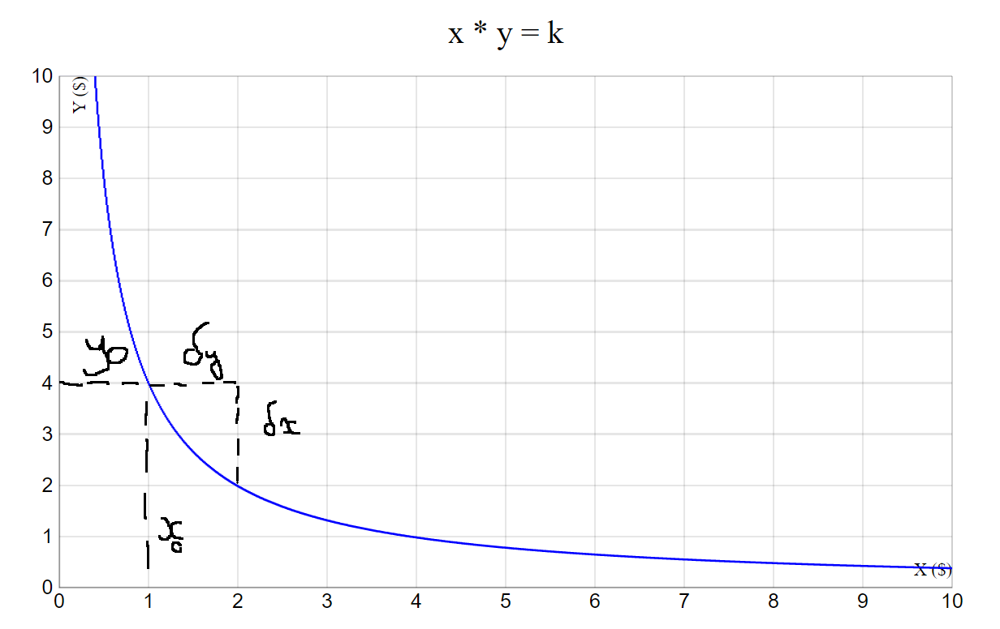

# Tutorial

Uniswap is regularly the [most used app in crypto](https://etherscan.io/dashboards/gas-guzzler) by a wide margin (in terms of blockspace). This can be explained but the strong need for users to exchange blockchains most abundant objects: tokens. In this tutorial, we're going to recreate [UniswapV2](https://blog.uniswap.org/uniswap-v2) from scratch, creating tested on-chain program using [Anchor](https://www.anchor-lang.com/) and a simple and effective front-end using a [NextJS](https://nextjs.org/) web app hosted with [Vercel](https://vercel.com/).

First we'll go over what Uniswap does and what its V2 specificities. Then, we'll present all the mathematical concepts used to make this AMM work before diving in the on-chain program. We'll then finish by creating a simple interface web app using NextJS.

## UniswapV2

### Overview

The goal of Automated Market Makers (AMM) is to act as an automatic buyer and seller for when users want to trade. The advantages of having an AMM can be:

- Always available trading: since an algorithm does the trading, it can be always on.
- Low operational costs: automation enables cheaper trades as there is no firm in charge of market making.

The hard part then becomes the choice of the algorithm for the AMM.
Recent progress in AMMs on blockchains have mostly been done using Constant Function AMM (CFAMM), where the AMM allows any trade that preserve a predefined condition on a constant function of the AMM's reserves called the Invariant. Enforcing the invariant forces reserves to evolve according to _Bonding Curve_.

The most famous (popularized by Uniswap V2) and one of the simplest CFAMM is the Constant Product AMM (CPAMM), where for a given quantity of liquidity, the product of both reserve is constant ($xy = K$, where $x$ denotes the reserve of token A held by the AMM, $y$ denotes the reserve of token B held by the AMM, and $K$ is a constant depending on liquidity).

Other interesting bonding curves include:

- Constant Sum AMM (CSAMM) where the invariant of the pool is $x + y = K$, which means that the price will be constant but reserves for each assets can be emptied.
- [Curve's stableswap](https://miguelmota.com/blog/understanding-stableswap-curve/) mixes CSAMM and CPAMM depending on the balance between tokens.
- Uniswap V3 Concentrated Liquidity AMM (CLAMM) uses a CPAMM but splits the curve inseveral independant buckets. This way, you can provide liquidity only to the price buckets where the tokens will trade instead of the whole curve.
- [Trader Joe CLAMM](https://docs.traderjoexyz.com/concepts/concentrated-liquidity), similar to UniV3 CLAMM, divides the price range into buckets but each bucket work as a CSAMM instead of a CPAMM.

Although CPAMMs are getting old and there are more efficient alternatives available, CPAMMs still have a lot going for them:

- Easier to understand and use. Unlike concentrated liquidity buckets you have to find and go through to trade, CPAMMs have a single pool that's straightforward to trade with.
- Memory efficiency. Because you only have to maintain one pool and not a set of buckets, you end up using a lot less memory (account rent in Solana) than alternatives. Compared to Serum/Openbook markets that costs about 4 SOL, creating a new pool costs only fractions of that.

For these reasons, this is the AMM we will focus on and try to implement here.

### Math


Let's suppose that the CPAMM currently has $(x_0, y_0) \in \mathbb{R}^{+*}$ reserves of tokens X and Y respectively, and a user wants to trade in $\delta_x$ tokens X for $\delta_y$ tokens Y. It's important to note that the basic CPAMM can never have an empty reserve. We want to find what the $\delta_y$ that the user will receive, or inversely, what $\delta_x$ is given a $\delta_y$.

Using the image below, we can see that if we start with the pool having $x_0 = 1$ and $y_0 = 4$, trading 1 token X will give us at best 2 tokens Y. We can see that because we traded a large portion of the pool's reserves, a lot of slippage occured: the initial price was 4Y = 1X but ended up at 1Y = 1X.



Now that we have the intuition of what is happening, we will try to formalize a bit how prices evolves with trades. We know that the trade preserves the invariant $xy = K$ so we can write $x_0 y_0 = K = (x_0 + \delta_x) (y_0 - \delta_y)$

$$
x_0 y_0 = K = (x_0 + \delta_x) (y_0 - \delta_y)
\\
x_0 y_0 - x_0 \delta_y + \delta_x y_0 - \delta_x \delta_y = x_0 y_0
\\
\delta_x \delta_y + x_0 \delta_y = \delta_x y_0
\\
\delta_y (\delta_x + x_0) = \delta_x y_0
\\
\delta_y = \frac{\delta_x y_0}{\delta_x + x_0}
$$

So we see that we can compute the amount of tokens to receive only using the initial reserves and the input amount. Inversely, we can compute $\delta_x$ given $\delta_y$ ("How much SOL do I need to sell to get 3USDC?"):

$$
x_0 y_0 - x_0 \delta_y + \delta_x y_0 - \delta_x \delta_y = x_0 y_0
\\
\delta_x y_0 - \delta_x \delta_y = x_0 \delta_y
\\
\delta_x (y_0 - \delta_y) = x_0 \delta_y
\\
\delta_x = \frac{x_0 \delta_y}{y_0 - \delta_y}
$$

Users can also deposit liquidity. This should not affect the current price of liquidity, and therefore should preserve the proportion of asset A and B.
Given the current reserve $(x, y)$ and the reserves user wants to add $(x_u, y_u)$, we want to find $(x_f, y_f)$ such that $x_f \leq x_u, y_f \leq y_u$:

$$
\frac{x}{y} = \frac{x_f}{y_f}
\\
\
\\
\text{if } {x > y}, x_f = \frac{y_u x}{y}, y_f = y_u
\\
\
\\
\text{else } {x < y}, x_f = x_u, y_f = \frac{x_u y}{x}
$$

## On-chain Program Implementation

### Setup

To follow this tutorial, you'll need to install [Anchor following these instructions](https://medium.com/r/?url=https%3A%2F%2Fwww.anchor-lang.com%2Fdocs%2Finstallation). It will make you install Rust, Solana, Node.js, Yarn and Anchor.

### Design

Let's recap what we need:
Each pool will have a fee to pay Liquidity Providers (LPs). This fee is taken on trade, paid in the traded token directly. The fee will be shared for all pools to preserve consistency in the trading experience.
There will be exactly one pool for each pair of asset. This limits liquidity fragmentation and makes it easier for devs to find the right pool
We need to keep the accounting for LPs deposits.

Since pools can share parameters (here, the trading fee), we should create one account for the them and the one account for each pool. This can generally save us some bytes of state, except for configuration smaller than 32 bytes (the size of the discriminator) because the other account needs to store its pubkey. In our case, we'll add an admin for the AMM that can control fees so we are above the limit.
Each pool should be unique and to ensure that we'll (a) use seeds to generate the Program Derived Account (PDA) and (b) add a constraints to make sure there is no ambiguity.
Finally, we'll use SPL token for accounting liquidity, this way it's easily composable.

### Principles

Below is a list of principles I believe are useful when building on-chain programs:

- Store keys in the account. When creating PDAs using seeds, it's good to store those keys in the account. Although it can be redundant, increasing account rent, it allows easily finding the account (you have everything in it to recreate it's pubkey) and pairs nicely with Anchor's `has_one` clause.
- Use straightforward seeds. PDA seeds should follow a simple logic to make it easy to remember and to clarify how accounts relate to each other. My logic is that you first put the seeds of the parent account, and then use the current object's identifiers, in alphabetical order ideally. For example, we have our AMM account storing the configuration that has no parent. The admin can change and so we can't use it as a key so we have to add an identifier attribute, generally a pubkey. For pools, they have the AMM as parent and are defined uniquely by the tokens they facilitate trades for, so I would first use the AMM's pubkey as seed, then token A's pubkey, then B's.
- Minimize instruction's scope. Keeping each instruction's scope as small as possible helps reduce transaction size (less accounts touched at once) while helping composability, but also helps readability and security. The disadvantage is the increased Lines Of Codes (LOC).

### Coding

The code for the whole tutorial can be found on Github. I will not explain every single file of the repo but will go over the most important ones and the general structure. Get started using these commands:

```bash
git clone https://github.com/Dodecahedr0x/amm-tutorial
cd amm-tutorial
yarn
anchor keys list
```

Don't forget to copy the program's key in the Anchor.toml file and in the lib.rs at the root of the program folder.
For now, we will focus on the program's structure in the ./programs/amm-tutorial/src folder, which looks like this:

```
programs/amm-tutorial/src/
├── constants.rs
├── errors.rs
├── instructions
│   ├── create_amm.rs
│   ├── create_pool.rs
│   ├── deposit_liquidity.rs
│   ├── mod.rs
│   ├── swap_exact_tokens_for_tokens.rs
│   └── withdraw_liquidity.rs
├── lib.rs
└── state.rs
```

Keeping files separate helps make the project cleaner in my opinion:
constants.rs contains all the constants the program uses. By using the macro #[constant] before the declaration of the constant, Anchor knows to export the constant in the generated IDL.
state.rs contains accounts definitions as well as any implementation for those accounts.
errors.rs contains all the different error codes so that Anchor can more explicit errors.
Instructions are separated in a module because each file can be lengthy can pasting them together make navigation harder.

1. **Account Definitions**

We start by defining all the accounts we will use. For each account, the first attributes are the keys, in the order they will appear in the seeds, followed by used attributes.

```rust
use anchor_lang::prelude::*;

#[account]
#[derive(Default)]
pub struct Amm {
    /// Primary key of the AMM
    pub id: Pubkey,

    /// Account that has admin authority over the AMM
    pub admin: Pubkey,

    /// The LP fee taken on each trade, in basis points
    pub fee: u16,
}

impl Amm {
    pub const LEN: usize = 8 + 32 + 32 + 2;
}

#[account]
#[derive(Default)]
pub struct Pool {
    /// Primary key of the AMM
    pub amm_id: Pubkey,

    /// Mint of token A
    pub mint_a: Pubkey,

    /// Mint of token B
    pub mint_b: Pubkey,
}

impl Pool {
    pub const LEN: usize = 8 + 32 + 32 + 32;
}
```

Note that the Pool account only stores its keys because liquidity is accounted for using SPL tokens. I like to implement a LEN const for each account that tracks the size of the account. This especially useful for accounts that use Vecs or Strings.

2. **Entrypoint (lib.rs)**

Solana programs have a single entrypoint and then generally route the execution to the specific instruction code using transaction data. Anchor does this routing for us thanks to the #[program] macro.

```rust
use anchor_lang::prelude::*;

mod constants;
mod errors;
mod instructions;
mod state;

pub use instructions::*;

// Set the correct key here
declare_id!("CUPMV4NGFSBQcjbPfZZJodNLkzfBUyjobW6Fg8E4fF7s");

#[program]
pub mod amm_tutorial {
    use super::*;

    pub fn create_amm(ctx: Context<CreateAmm>, id: Pubkey, fee: u16) -> Result<()> {
        instructions::create_amm(ctx, id, fee)
    }

    pub fn create_pool(ctx: Context<CreatePool>) -> Result<()> {
        instructions::create_pool(ctx)
    }

    pub fn deposit_liquidity(
        ctx: Context<DepositLiquidity>,
        amount_a: u64,
        amount_b: u64,
    ) -> Result<()> {
        instructions::deposit_liquidity(ctx, amount_a, amount_b)
    }

    pub fn withdraw_liquidity(ctx: Context<WithdrawLiquidity>, amount: u64) -> Result<()> {
        instructions::withdraw_liquidity(ctx, amount)
    }

    pub fn swap_exact_tokens_for_tokens(
        ctx: Context<SwapExactTokensForTokens>,
        swap_a: bool,
        input_amount: u64,
        min_output_amount: u64,
    ) -> Result<()> {
        instructions::swap_exact_tokens_for_tokens(ctx, swap_a, input_amount, min_output_amount)
    }
}
```

We only do the routing to the proper instruction here, defined in the instructions folder. Notice how there is no instruction defined to close AMMs or pools. It is good practice to allow closing accounts to prevent state bloat and save users SOL, but in this case we will rarely be able to close pools because there might be liquidity left. AMMs can’t be closed until all their pools are closed as well.

3. **Create AMM**

The first instruction is the creation of the AMM. It only sets the initial values for the configuration. We need to check that these values are correct when they are set so we can trust them later on.

```rust
use anchor_lang::prelude::*;

use crate::{errors::*, state::Amm};

pub fn create_amm(ctx: Context<CreateAmm>, id: Pubkey, fee: u16) -> Result<()> {
    let amm = &mut ctx.accounts.amm;
    amm.id = id;
    amm.admin = ctx.accounts.admin.key();
    amm.fee = fee;

    Ok(())
}

#[derive(Accounts)]
#[instruction(id: Pubkey, fee: u16)]
pub struct CreateAmm<'info> {
    /// The account storing the AMM configuration
    #[account(
        init,
        payer = payer,
        space = Amm::LEN,
        seeds = [
            id.as_ref()
        ],
        bump,
        constraint = fee < 10000 @ TutorialError::InvalidFee,
    )]
    pub amm: Account<'info, Amm>,

    /// The admin of the AMM
    /// CHECK: Read only, delegatable creation
    pub admin: AccountInfo<'info>,

    /// The account paying for all rents
    #[account(mut)]
    pub payer: Signer<'info>,

    /// Solana ecosystem accounts
    pub system_program: Program<'info, System>,
}
```

The AMM is uniquely identified by it’s ID, therefore it’s the only seed we use. We check that the fee is indeed a basis point value < 100%. We use errors defined in errors.rs to have a more explicit errors, which is useful when there are several constraint clauses. We separate the payer from the admin in case we want delegated creation. This comes in handy when interacting with Realms DAO, because they can’t create accounts.

Finally, we add the admin as an account instead of an instruction parameter to make sure it’s an valid account and not a random pubkey. However, we have to tell Anchor that it’s okay if we do not know this account beforehand by adding the `/// CHECK:` comment.

4. **Create Pool**

I will not go over the whole file as you can find it in the repo, but instead will focus on illustrating some of the principles talked about earlier.

```rust
#[derive(Accounts)]
pub struct CreatePool<'info> {
    #[account(
        seeds = [
            amm.id.as_ref()
        ],
        bump,
    )]
    pub amm: Account<'info, Amm>,

    #[account(
        init,
        payer = payer,
        space = Pool::LEN,
        seeds = [
            amm.key().as_ref(),
            mint_a.key().as_ref(),
            mint_b.key().as_ref(),
        ],
        bump,
        constraint = mint_a.key() < mint_b.key() @ TutorialError::InvalidMint
    )]
    pub pool: Account<'info, Pool>,

    /// CHECK: Read only authority
    #[account(
        seeds = [
            amm.key().as_ref(),
            mint_a.key().as_ref(),
            mint_b.key().as_ref(),
            AUTHORITY_SEED.as_ref(),
        ],
        bump,
    )]
    pub pool_authority: AccountInfo<'info>,

    #[account(
        init,
        payer = payer,
        seeds = [
            amm.key().as_ref(),
            mint_a.key().as_ref(),
            mint_b.key().as_ref(),
            LIQUIDITY_SEED.as_ref(),
        ],
        bump,
        mint::decimals = 6,
        mint::authority = pool_authority,
    )]
    pub mint_liquidity: Box<Account<'info, Mint>>,

    ...
}
```

Here you can see 3 accounts: the pool itself, its authority and the mint of the liquidity token. They are all derived from the pool so they share their seeds but are differentiated by the litteral string at the end.

By enforcing the order of mint tokens (c.f. constraint on the pool account), we make sure that there cannot be 2 pools with the same tokens. The strict inequality also prevents pools having the same tokens, which would cause unexpected behaviors.

Since the liquidity mint account is created using seeds, we do not need to store its pubkey in the pool account, saving 32 bytes of rent.

5. **Depositing liquidity**

When depositing liquidity, the user has to provide some amounts of both tokens. If there is no liquidity, then the first LP defines the initial ratio between both assets, otherwise we add assets according to the maximum the LP wants to provide and the current ratio.

In DeFi, we often need to make computations using floating points but tokens have integer units. Rust has floating point computations (f64) but there are some limitations for using them. Thankfully, using Rust allows us to benefit from the myriad of libraries available. Using fixed and fixed-sqrt will handle everything we need for AMM computations.

The process is as follows:

1. Sanitize amounts to provide
2. Compute the liquidity it will generate
3. (On first deposit) Lock away some amount of liquidity to make sure the pool will always be tradable from now on
4. Transfer tokens from the LP to the pool
5. Mint liquidity tokens to the LP

```rust
pub fn deposit_liquidity(
    ctx: Context<DepositLiquidity>,
    amount_a: u64,
    amount_b: u64,
) -> Result<()> {
    // Prevent depositing assets the depositor does not own
    let mut amount_a = if amount_a > ctx.accounts.depositor_account_a.amount {
    ctx.accounts.depositor_account_a.amount
    } else {
    amount_a
    };
    let mut amount_b = if amount_b > ctx.accounts.depositor_account_b.amount {
    ctx.accounts.depositor_account_b.amount
    } else {
    amount_b
    };

    // Making sure they are provided in the same proportion as existing liquidity
    let pool_a = &ctx.accounts.pool_account_a;
    let pool_b = &ctx.accounts.pool_account_b;
    // Defining pool creation like this allows attackers to frontrun pool creation with bad ratios
    let pool_creation = pool_a.amount == 0 && pool_b.amount == 0;
    (amount_a, amount_b) = if pool_creation {
        // Add as is if there is no liquidity
        (amount_a, amount_b)
    } else {
        let ratio = I64F64::from_num(pool_a.amount)
            .checked_mul(I64F64::from_num(pool_b.amount))
            .unwrap();
        if pool_a.amount > pool_b.amount {
            (
                I64F64::from_num(amount_b)
                    .checked_mul(ratio)
                    .unwrap()
                    .to_num::<u64>(),
                amount_b,
            )
        } else {
            (
                amount_a,
                I64F64::from_num(amount_a)
                    .checked_div(ratio)
                    .unwrap()
                    .to_num::<u64>(),
            )
        }
    };

    // Computing the amount of liquidity about to be deposited
    let mut liquidity = I64F64::from_num(amount_a)
        .checked_mul(I64F64::from_num(amount_b))
        .unwrap()
        .sqrt()
        .to_num::<u64>();

    // Lock some minimum liquidity on the first deposit
    if pool_creation {
        if liquidity < MINIMUM_LIQUIDITY {
            return err!(TutorialError::DepositTooSmall);
        }

        liquidity -= MINIMUM_LIQUIDITY;
    }

    // Transfer tokens to the pool
    token::transfer(
        CpiContext::new(
            ctx.accounts.token_program.to_account_info(),
            Transfer {
                from: ctx.accounts.depositor_account_a.to_account_info(),
                to: ctx.accounts.pool_account_a.to_account_info(),
                authority: ctx.accounts.depositor.to_account_info(),
            },
        ),
        amount_a,
    )?;
    token::transfer(
        CpiContext::new(
            ctx.accounts.token_program.to_account_info(),
            Transfer {
                from: ctx.accounts.depositor_account_b.to_account_info(),
                to: ctx.accounts.pool_account_b.to_account_info(),
                authority: ctx.accounts.depositor.to_account_info(),
            },
        ),
        amount_b,
    )?;

    // Mint the liquidity to user
    let authority_bump = *ctx.bumps.get("pool_authority").unwrap();
    let authority_seeds = &[
        &ctx.accounts.pool.amm.to_bytes(),
        &ctx.accounts.mint_a.key().to_bytes(),
        &ctx.accounts.mint_b.key().to_bytes(),
        AUTHORITY_SEED.as_bytes(),
        &[authority_bump],
    ];
    let signer_seeds = &[&authority_seeds[..]];
    token::mint_to(
        CpiContext::new_with_signer(
            ctx.accounts.token_program.to_account_info(),
            MintTo {
                mint: ctx.accounts.mint_liquidity.to_account_info(),
                to: ctx.accounts.depositor_account_liquidity.to_account_info(),
                authority: ctx.accounts.pool_authority.to_account_info(),
            },
            signer_seeds,
        ),
        liquidity,
    )?;

    Ok(())

}
```

6. **Swapping**

Using the math we wrote in the previous section we can now simply implement these computations and have a guarantee the swap is done correctly. To make sure, we even check that the invariant still holds after the trade.

The process is as follows:

1. Sanitize inputs
2. Take the fee defined by the AMM from the trade input
3. Compute the ouput using the formula
4. Transfer the input to the pool and the output to the trader
5. Check invariant

```rust
pub fn swap_exact_tokens_for_tokens(
    ctx: Context<SwapExactTokensForTokens>,
    swap_a: bool,
    input_amount: u64,
    min_output_amount: u64,
) -> Result<()> {
    // Prevent depositing assets the depositor does not own
    let input = if swap_a && input_amount > ctx.accounts.trader_account_a.amount {
    ctx.accounts.trader_account_a.amount
    } else if !swap_a && input_amount > ctx.accounts.trader_account_b.amount {
    ctx.accounts.trader_account_b.amount
    } else {
    input_amount
    };

    // Apply trading fee, used to compute the output
    let amm = &ctx.accounts.amm;
    let taxed_input = input - input * amm.fee as u64 / 10000;

    let pool_a = &ctx.accounts.pool_account_a;
    let pool_b = &ctx.accounts.pool_account_b;
    let output = if swap_a {
        I64F64::from_num(taxed_input)
            .checked_mul(I64F64::from_num(pool_b.amount))
            .unwrap()
            .checked_div(
                I64F64::from_num(pool_a.amount)
                    .checked_add(I64F64::from_num(taxed_input))
                    .unwrap(),
            )
            .unwrap()
    } else {
        I64F64::from_num(taxed_input)
            .checked_mul(I64F64::from_num(pool_a.amount))
            .unwrap()
            .checked_div(
                I64F64::from_num(pool_b.amount)
                    .checked_add(I64F64::from_num(taxed_input))
                    .unwrap(),
            )
            .unwrap()
    }
    .to_num::<u64>();

    if output < min_output_amount {
        return err!(TutorialError::OutputTooSmall);
    }

    // Compute the invariant before the trade
    let invariant = pool_a.amount * pool_b.amount;

    // Transfer tokens to the pool
    let authority_bump = *ctx.bumps.get("pool_authority").unwrap();
    let authority_seeds = &[
        &ctx.accounts.pool.amm.to_bytes(),
        &ctx.accounts.mint_a.key().to_bytes(),
        &ctx.accounts.mint_b.key().to_bytes(),
        AUTHORITY_SEED.as_bytes(),
        &[authority_bump],
    ];
    let signer_seeds = &[&authority_seeds[..]];
    if swap_a {
        token::transfer(
            CpiContext::new(
                ctx.accounts.token_program.to_account_info(),
                Transfer {
                    from: ctx.accounts.trader_account_a.to_account_info(),
                    to: ctx.accounts.pool_account_a.to_account_info(),
                    authority: ctx.accounts.trader.to_account_info(),
                },
            ),
            input,
        )?;
        token::transfer(
            CpiContext::new_with_signer(
                ctx.accounts.token_program.to_account_info(),
                Transfer {
                    from: ctx.accounts.pool_account_b.to_account_info(),
                    to: ctx.accounts.trader_account_b.to_account_info(),
                    authority: ctx.accounts.pool_authority.to_account_info(),
                },
                signer_seeds,
            ),
            output,
        )?;
    } else {
        token::transfer(
            CpiContext::new_with_signer(
                ctx.accounts.token_program.to_account_info(),
                Transfer {
                    from: ctx.accounts.pool_account_a.to_account_info(),
                    to: ctx.accounts.trader_account_a.to_account_info(),
                    authority: ctx.accounts.pool_authority.to_account_info(),
                },
                signer_seeds,
            ),
            input,
        )?;
        token::transfer(
            CpiContext::new(
                ctx.accounts.token_program.to_account_info(),
                Transfer {
                    from: ctx.accounts.trader_account_b.to_account_info(),
                    to: ctx.accounts.pool_account_b.to_account_info(),
                    authority: ctx.accounts.trader.to_account_info(),
                },
            ),
            output,
        )?;
    }

    msg!(
        "Traded {} tokens ({} after fees) for {}",
        input,
        taxed_input,
        output
    );

    // Verify the invariant still holds
    // Reload accounts because of the CPIs
    // We tolerate if the new invariant is higher because it means a rounding error for LPs
    ctx.accounts.pool_account_a.reload()?;
    ctx.accounts.pool_account_b.reload()?;
    if invariant > ctx.accounts.pool_account_a.amount * ctx.accounts.pool_account_a.amount {
        return err!(TutorialError::InvariantViolated);
    }

    Ok(())

}
```

### Tests

Testing is an important part of development but I still don’t feel satisfied by the why I do tests using Anchor, so bear that in mind in the following section, I would be glad to have some feedbacks.

The structure I went with is the following:

```
tests/
├── create-amm.ts
├── create-pool.ts
├── deposit-liquidity.ts
├── swap.ts
├── utils.ts
└── withdraw-liquidity.ts
```

Again, splitting files makes it easier for me to find the case I’m looking for rather than scrolling and endless files. Test suites can quickly become big, especially if you want to be exhaustive. To make that easier, I create a function (createValues) that return all the addresses, PDA, keypairs, values, etc, that I could possibly need in the utils.ts file to avoid repeating too much code.

I generally like to develop a Typescript SDK along tests, that will be used in the front end, but this is out of scope for this tutorial.

Running anchor test at the root of the folder should build the program, deploy it on a test validator and then run all the test suites in tests folder.

## Conclusion

We have implemented a simple but functional Constant Product Automated Market Maker on Solana using Anchor. We have seen how AMMs work and I hope you got a glimpse of how bonding curves in general can be used to create and design mechanisms for your project.

I first invite you to expand the current program to make it your own. Some leads of what can be done:

- Adding an admin fee that transfers some token to the AMM admin. This should help finance further developments.
- Create the swap_tokens_for_exact_tokens , the function that let’s user fix the output and the AMM computes the required input.
- Implement more complex curves (e.g. Velodrome stableswap using the invariant x³y+y³x >= k)
- Compose it with a staking program to create a farm
